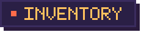
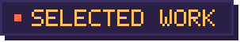
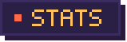
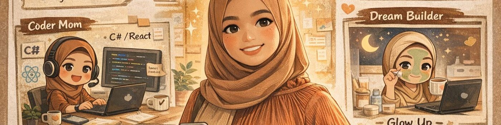

  <b>Hi, I'm Naowal ♥</b> — a software engineer from Nakhon Si Thammarat, Thailand, who believes good code starts with a caring heart. 
  สวัสดีค่ะ นวลเองนะคะ — ซอฟต์แวร์เอนจิเนียร์จากนครศรีธรรมราช ที่เชื่อว่าโค้ดที่ดี เริ่มจากใจที่ตั้งใจ

  
  
  
  
  

 

8+ years across **fintech, e-commerce and logistics**, on-site and remote. I care about honesty, an easygoing way of working together, and a steady pursuit of excellence — not just getting things done, but making them a little better each time.

I also love turning hard technical topics into something approachable: I was a **Learning Designer at FutureSkill** (Big Data, Data Engineering, React, TypeScript), I write about Django, and I run a small community called **[ThaiDjango](https://www.facebook.com/ThaiDjango/)**.

- 🎓 B.Sc. Computer Science (2nd Class Honors), Prince of Songkla University — on a national Computer Science Olympiad (POSN) scholarship
- 🧭 Currently: Software Programmer @ **Finsoft** — AMC Registrar Management (VB.NET · MS-SQL)
- 💬 Ask me about: Django, full-stack web, fintech systems, learning design

 

**Backend** 

**Frontend & Full-stack** 

**Systems & Data** 

**Teaching & Community** 

 

| Stage | Quest | Guild |
| :-- | :-- | :-- |
| **Dec 2024 – now** | ⚔️ **Software Programmer** — AMC Registrar Management for Asset Plus, LH Fund, Krungsri & Krungthai AM | Finsoft |
| **Apr 2023 – Oct 2024** | 📚 **Learning Designer** — Big Data, Data Engineering, React & TypeScript courses | FutureSkill |
| **Jul – Dec 2022** | 🛠️ **Software Engineer** — built fitcrew.cc & WeaselHR from scratch (Django · DRF · Svelte · Tailwind) | PRODIGY9 |
| **Jun – Jul 2022** | 🚚 **Software Engineer (Remote)** — logistics system (Python · Svelte · SQL) | Forward Insight |
| **May – Sep 2021** | 🏰 **Software Architect & Asst. Tech Lead** — e-Permit system for PTT (OutSystems) | Buzzfreeze Solution |
| **Sep 2020 – May 2021** | 🔍 **Django & Java Developer** — Isuzu systems analysis & testing | Inventus Technologies |
| **2017 – 2019** | 🎓 **Freelance PM · Course Creator · Golang Programmer** | BuzzFreeze Solution |

<b>▸ Earlier quests</b>

 

| Stage | Quest | Guild |
| :-- | :-- | :-- |
| **Dec 2019 – Feb 2020** | Python Developer — Django app for employee work tracking | DomeCloud |
| **Mar – Aug 2019** | Python Developer — two Django sites (IT bookstore, training videos) | Cons Robotics |
| **2010 – 2014** | B.Sc. Computer Science, 2nd Class Honors — POSN scholarship | Prince of Songkla University |

 

| | Project | Stack |
| :-: | :-- | :-- |
| 🪑 | **[Furniture Sales System](https://github.com/naowal-siripatana/Furniture-Sales-System)** — full-stack furniture store | TypeScript · React · FastAPI |
| 📓 | **[Daily Interest Lock Book](https://github.com/naowal-siripatana/Daily_Interest_Lock_book)** — tracking the things I discover every day, to plan toward real goals | — |
| 📰 | **[gonews](https://github.com/naowal/gonews)** — news platform | Go |
| 🛒 | **[MyShop](https://github.com/naowal/MyShop)** — online shop | Django |
| 🎓 | **[uncle-engineer-mooc](https://github.com/naowal/uncle-engineer-mooc)** — MOOC platform | Django |

> 🎮 Want the full story? **[Play my profile →](https://naowal-siripatana.github.io/)** — 5 regions, collectible items, and a final boss called the *Legacy Bug*.

 

  
  

<picture>
  <source media="(prefers-color-scheme: dark)" srcset="https://raw.githubusercontent.com/naowal-siripatana/naowal-siripatana/output/snake-dark.svg" />
  <source media="(prefers-color-scheme: light)" srcset="https://raw.githubusercontent.com/naowal-siripatana/naowal-siripatana/output/snake-light.svg" />
  
</picture>

 

   
  <i>The other sides of me — coder, mom, and dreamer, who still makes time for a little self-care.</i>

 

Looking for a teammate who's steady, kind and keeps leveling up? Let's party up ♥

  
  

